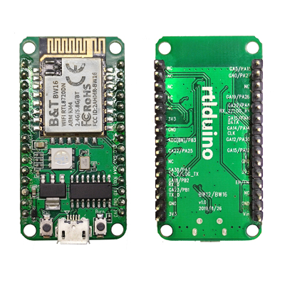

# RTL8720DN BW16 IoT Development Board Arduino Package

RTL8720DN from Realtek is a dual-band WiFi (2.4 + 5 GHz) and BLE 5.0 capable IoT module running on dual-core ARM Cortex-M33 preocessor, mounted on top of the BW16 development board which offers tons of features and remains at affroable price (about $3 on AliExpress with Coupon). 

This Arduino board package is a fork of the official [AmebaD Arduino](https://github.com/ambiot/ambd_arduino) repo and is customized for RTL8720DN BW16.

# Adding RTL8720DN (BW16) to Arduino IDE:

**Follow steps below to set up**

1. Make sure your Arduino IDE version is 1.6.5 and above
	Open your Arduino IDE, navigate to "File" -> "Preferences".

	Then paste the following link into the "Additional Boards Manager URLs:"

	https://github.com/xidameng/ambd_arduino/raw/master/Arduino_package/package_rtl8720_index.json

2. Install the board using Board Manager
	Navigate to "Tools" -> "Board" -> "Boards Manager".

	Wait for for a while while IDE downloading index information.

	Then in the search bar, type "ameba" and you will see Realtek Ameba in the list.

	Now just press "Install" and let the IDE handle the rest.

3. Select Ameba in "Tools" -> "Board" -> "Ameba Arduino".
	Now you are able to develop Arduino code and upload image onto Ameba.

	More information refer to https://www.amebaiot.com/en/ameba-arduino-summary/
# BW16_RTL8720DN_Arduino
